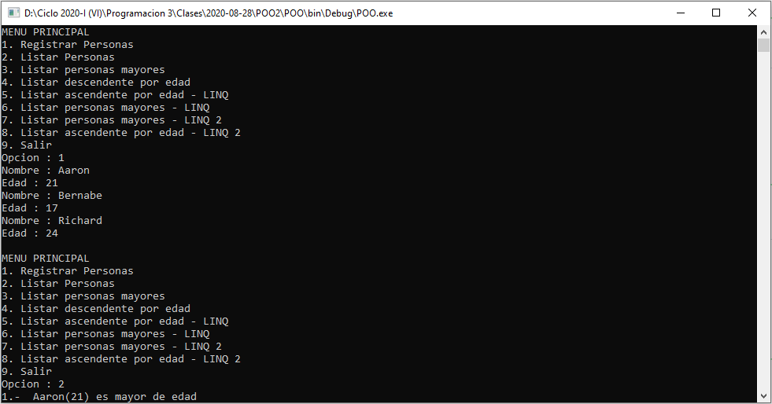

# Control de personas 3 v2
Sistema de control de personas que permite ingresar los datos de una persona, mostrar los datos registrados, mostrar las personas mayores de edad, listado las personas ordenadas descendentemente por edad, listado las personas ordenadas ascendentemente por edad con LINQ, listado de las personas mayores con LINQ, listado de las personas mayores con LINQ v2 y listado las personas ordenadas ascendentemente por edad con LINQ v2, **28/08/20**

<strong>Imagen:</strong> Menú principal - Registrar personas.

